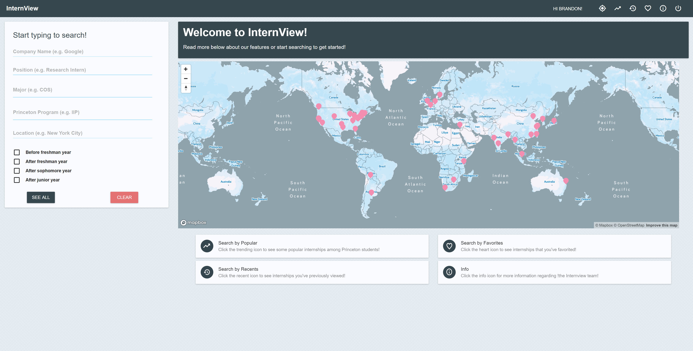

# InternView

## Elevator Pitch
A common problem that Princeton students face is the pressure of finding an internship for the summer. This task is often extremely daunting, and to make matters worse, there isn’t a comprehensive resource available to help students in the process. Current job info sites, such as Glassdoor and Handshake, do not provide an inside look into what Princeton students have done in the past and what resources would best prepare applicants for both the interview and internship. InternView addresses this issue by facilitating the internship search process by allowing them to learn about previous students’ experiences and how to obtain these opportunities. Our application gives access to honest reviews written by Princeton students and offers many features to help find the perfect internship opportunity. InternView strives to be *the* site that Princeton students turn to for their internship needs and professional dreams.

## Link to InternView
[InternView](http://internview.herokuapp.com)

## Made by
Audrey Cheng, Jonathan Jow, William Lin, Brandon May, and Jason Xu under the supervision of Jerry Wei for [COS 333](https://www.cs.princeton.edu/courses/archive/spring18/cos333/), Spring 2018, taught by Professor Brian Kernighan.